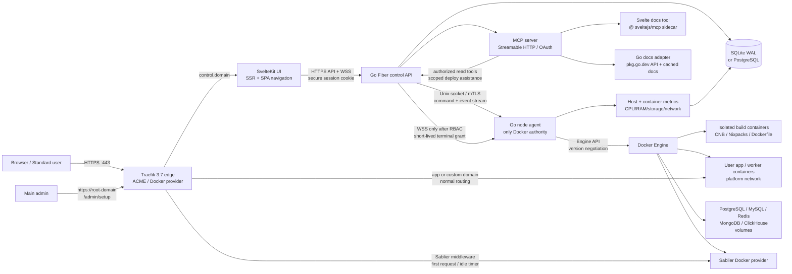

# Self-hosted PaaS implementation blueprint

**Purpose.** This is the implementation contract for coding agents building a lightweight, single-node, self-hosted SaaS/PaaS. It deliberately starts as a secure one-host control plane, while keeping clean seams for a later node agent and PostgreSQL migration. It must run on either Linux `amd64` or `arm64`, including a mini PC, Raspberry Pi-class device, or an Oracle Cloud VM. Product terminology is consistent throughout: a **workspace** owns **projects**; a project owns one or more **services** and provisioned databases.

**Research snapshot: 2026-08-13.** Use the latest stable patch in the selected compatible release line at implementation time and commit an exact lockfile/digest. The reference baselines are Go 1.26 (current stable line), Fiber v3 (current v3 line), SvelteKit 2.70.1 (`latest` at research time), Docker Engine API v1.55 with API-version negotiation, Traefik v3.7 with v3.6.0 as the minimum for Sablier's stopped-container labels, Sablier server 1.10.x and Traefik plug-in v1.3.0, and the MCP 2026-07-28 specification with the official Go SDK v1.7.0+. Do not use floating `latest` tags in production images.

## 1. Decisions, non-negotiables, and version policy

| Area | Decision | Why it is the default |
|---|---|---|
| Control-plane API | Go 1.26 + Fiber v3 | Fiber is fast, small, and supports WebSocket/SSE; use its supported v3 API only. Keep all long-running Docker work out of request handlers. |
| Web UI | SvelteKit 2.70.x + TypeScript, adapter-node, SSR for shell/auth and SPA-style navigation after load | Small client payload, fast first page, and good streaming/UI composition. |
| Proxy | Traefik 3.7.x with Docker provider, ACME, and Sablier plug-in | Its Docker labels generate routes dynamically and `allownonrunning` preserves a route while a scaled-to-zero service is stopped. Caddy is a documented alternative, but requires a custom Caddy build to add the Sablier module; do not maintain both proxy implementations in v1. |
| Scale-to-zero | Sablier Docker provider + Traefik plug-in, dynamic waiting page strategy by default | Wakes the service on the first request and stops it after inactivity. Use the plug-in's `blocking` strategy only after E2E validation; it holds client connections and is less pleasant during cold starts. |
| Builds | Cloud Native Buildpacks/Paketo for maintained auto-detection; Nixpacks as a supported compatibility driver; Dockerfile and explicit manual stack drivers | Nixpacks still supports generated/merged build plans, but its upstream now recommends Railpack as its replacement. Avoid making a single upstream's deprecated-by-recommendation tool the only production path. |
| Data | SQLite in WAL mode for one control-plane host; PostgreSQL 18+ for multi-process/high-write operation | Application code talks through one repository interface and dialect migrations. SQLite foreign keys are explicitly enabled on every connection. |
| IDs and time | UUIDv7 generated in Go, stored as `TEXT` in SQLite and `uuid` in PostgreSQL; UTC `timestamptz` | Sortable identifiers, portable data, no database-specific ID code path. |
| Docker access | A narrowly scoped Go **node agent** is the only component allowed to access `/var/run/docker.sock`; the public API calls it over a local Unix socket (v1) or mutual-TLS (future nodes) | Docker-socket access is host-administrative. This boundary prevents the web/API process and browser-facing terminal proxy from gaining ambient host control. |
| Authentication | Local email/password plus sessions in v1; every new signup is `pending`; only `main_admin` may activate it | Meets the approval requirement and makes administration explicit. Add OIDC only after this path is fully audited. |

**Exact-version rule.** Dependabot/Renovate (or an equivalent scheduled checker) opens updates; CI verifies them; production uses (a) Go/module and pnpm lockfiles, and (b) SHA-256 image digests. Check security advisories before every Traefik upgrade. Never pin to a major/minor image tag alone, and never deploy an unreviewed `:latest` image.

## 2. Scope and deployment model

### v1 target

One Linux `amd64` or `arm64` host with Docker Engine, a public IPv4 address or IPv6 address, ports 80/443 open, and a wildcard DNS record `*.example.com -> host IP`. The control plane runs at `https://example.com`; every default app URL is `https://<service-slug>.<project-slug>.example.com` only if DNS supports nested wildcard, otherwise use the safer default `https://<app-slug>.example.com`. The latter is recommended as it only requires `*.example.com`.

Build and publish multi-architecture platform images (`linux/amd64`, `linux/arm64`). At install time, the preflight check detects host architecture, available CPU/RAM/storage, Docker API compatibility, cgroup support, and the selected images' manifest support. It rejects unsupported builder/runtime images before any deployment begins. Capacity is discovered at runtime; never encode a particular processor, accelerator, RAM amount, or disk size as a requirement.

The initial setup wizard is **not** a general user page:

1. The first bootstrap account receives `main_admin` through an installation secret or single-use local bootstrap command.
2. Before setup is complete, all authenticated users except the main admin get a read-only “Platform is being configured” page.
3. The main admin is redirected to `/admin/setup`, the only page that can set or replace the root domain, ACME email, DNS mode, and platform networking.
4. The agent verifies DNS and port reachability, writes the Traefik static config, starts/reloads the platform edge, and stores only the resulting configuration and encrypted credentials.
5. User services can create only subdomains/custom-domain requests; they cannot alter root-domain or ACME-account settings.

### Explicit non-goals for v1

No Kubernetes, Docker Swarm, multi-host scheduling, arbitrary host command execution, root-shell access, registry UI, billing, or transparent database clustering. Build the interfaces for later expansion, but do not fake multi-node behavior in the initial release.

## 3. System architecture



### Trust zones and traffic

1. **Public edge:** Traefik owns 80/443. It redirects HTTP to HTTPS, terminates TLS, never exposes its insecure dashboard, and has only the Docker permissions needed to discover platform-labelled containers. Docker defaults to `exposedByDefault=false`.
2. **Control plane:** SvelteKit and Fiber are different containers. SvelteKit reaches Fiber over the private `platform-control` network. Browser API calls use same-origin `/api` proxying or a tightly limited `api.<domain>` origin with CSRF protection.
3. **Node authority:** The Go node agent validates every request against an allow-list of platform labels, generated resource names, and data stored by the control API. Its Unix socket is group-readable only by the API service account. It rejects a Docker container ID, network, volume, image, or exec command that was not produced by the platform's own deployment record.
4. **Tenant workloads:** Each project gets `paas-prj-<id>` as a private, attachable Docker network. A service and a linked database share it; no host ports are published. Traefik joins it only for web services. All platform containers also share a separate `platform-control` network.
5. **Persistent state:** Named Docker volumes have generated names such as `paas-db-<database-id>-data`. The platform database, Traefik ACME state, build cache, and each user database are independently backed up. Never use anonymous volumes for data that must survive a deployment.

### Control/API topology

Use a typed internal contract instead of a large HTTP controller calling Docker directly.

```text
Fiber handler -> application use case -> repository / agent client -> response
                                      -> outbox event -> worker / broadcaster
```

Use a database-backed job queue (`jobs` table) for deploy, stop, restart, delete, backup, restore, TLS validation, and metrics tasks. A successful HTTP mutation creates an idempotency key, writes domain data plus an outbox/job in one transaction, returns `202 Accepted`, and the worker executes it. A WebSocket topic delivers state transitions. This prevents request timeouts and duplicate deployments.

## 4. User journeys and UI contract

### Visual language

The layout is mandatory, not a suggestion.

* Page canvas: `#F4F6F8` very light cool gray; main content panel: pure `#FFFFFF`.
* Left rail: solid deep navy `#0B1F3A`, no gradient. Active nav: `#173B69`; hover: `#12305A`; rail text: `#EAF1FA`.
* Accent: cyan `#00A6A6` for positive actions and focus; destructive: `#C73E4D`; warning: `#B7791F`; neutral ink: `#16202A`.
* Sidebar is `width: 264px`, fixed on desktop, `margin: 16px`, `border-radius: 18px`, full available viewport height, dark solid fill, grouped icon+label navigation, account control at bottom. It collapses to a modal drawer below 960px.
* Main region is a large white rounded panel adjacent to the rail, `margin: 16px 16px 16px 0`, `border-radius: 18px`, light neutral border/shadow, comfortable 24–32px content padding. Data tables preserve a white surface with restrained dividers, never colored gradient cards.
* Use a system-first sans font stack, 8px spacing scale, 10px radii for controls, 44px minimum touch targets, strong focus rings, WCAG AA contrast, and full keyboard navigation.

### Routes and navigation

| Area | Routes | Who sees it |
|---|---|---|
| Work | `/workspaces`, `/workspaces/[slug]`, `/projects/[projectSlug]`, `/services/[serviceSlug]` | Workspace members according to role |
| Service tabs | Overview, Deployments, Logs, Terminal, Variables, Domains, Scale, Resources, Settings | Developers may deploy/log; Admin/Owner controls secrets, domains, deletion, and resource limits |
| Data | `/databases`, `/databases/[id]`, `/volumes/[id]` | Workspace members; credential reveal is Owner/Admin only and audited |
| Account | `/profile`, `/access/pending` | Individual users |
| Administration | `/admin`, `/admin/setup`, `/admin/users`, `/admin/telemetry`, `/admin/audit`, `/admin/platform` | `main_admin`; admins can have limited telemetry/read-only roles only if explicitly granted |

### One-click deployment wizard

The normal user never sees raw Docker arguments, container IDs, network names, proxy labels, or ACME configuration.

1. **Choose source.** Git repository + branch + optional root directory, upload archive, or “empty service.” Validate the clone URL; encrypt deploy credentials; display only a fingerprint.
2. **Select service.** Web service (default), worker, cron, or static site. The web choice defaults to port 3000 only as a placeholder; detection/health check confirms the actual port later.
3. **Choose build.** `Auto detect (recommended)`, Dockerfile, Manual stack, or Container image. Auto detection chooses Paketo CNB first and offers Nixpacks compatibility when requested. Dockerfile needs only path/context. Manual stack shows one select: Python, Node.js, Go, Rust, or Static; then build and start commands. Commands are visible only in this step and the advanced build settings page.
4. **Configure.** User-friendly environment variable entries, a port, health-path, compute preset, and optional linked data service. Secret values are masked after save. Never put database/password values in a URL query, deployment log, or event payload.
5. **Publish.** Suggest `<app-slug>.<root-domain>`; allow custom domain request. Show a concise “Your app will build and become public at …” review. Behind the scenes the API creates the project network, labels, route, secret injection, build job, container, health check, and certificate request.
6. **Observe.** Route to deployment detail with live log stream, status timeline, URL button, and clear errors. “Open terminal” appears only when a running service exists and the member has terminal permission.

### Admin and telemetry UX

`/admin/telemetry` shows a clear capacity strip based on the actual host: RAM **used / detected total**, CPU utilization, and storage **used / detected total**. Below it: 1-, 15-, and 60-minute trend charts, Docker container usage, build pressure, disk warning at configurable thresholds (80/90% by default), per-project quota reservations, and recent OOM/restart events. The page must work without an accelerator or vendor-specific monitoring library.

## 5. Build, deployment, networking, and lifecycle design

### Builder interface

Define an internal interface; do not put `if buildMode == ...` branches throughout handlers.

```go
type BuildDriver interface {
    Validate(BuildRequest) error
    Plan(context.Context, BuildRequest) (BuildPlan, error)
    Build(context.Context, BuildPlan, LogSink) (ImageArtifact, error)
}
```

Implement these drivers in order:

| Driver | User-facing selection | Agent behavior | Guardrails |
|---|---|---|---|
| `cnb` | Auto detect | Runs `pack build` with an approved Paketo builder and a per-build cache volume; saves image digest and BOM/SBOM references | No host networking unless an admin allows it; resource/pid/time limits; source mounted read-only except a work directory. |
| `nixpacks` | Auto detect (compatibility) | Runs pinned Nixpacks image/CLI, records the generated plan, builds OCI image | Because upstream recommends Railpack, keep this behind the driver contract and make CNB the maintained default. |
| `dockerfile` | Dockerfile | Docker BuildKit build from allowed context and Dockerfile path | Forbid build context outside checked-out source; use `.dockerignore`; never pass platform secrets as build args. |
| `manual` | Python/Node/Go/Rust/Static | Generates a reviewed, deterministic Dockerfile template using chosen runtime plus commands | Shell commands execute only inside the isolated build container; command length limits and redacted logs. |
| `image` | Existing image | Pulls an immutable image digest, not arbitrary local image ID | Require allowed registry policy and vulnerability/SBOM hook when enabled. |

Builds must receive no runtime secrets. Each run gets a generated image tag plus immutable digest, e.g. `registry.local/paas/service:<deployment-id>@sha256:...`; the digest is the source of truth. Persist a complete immutable config snapshot on `deployments` so rollback can reproduce prior runtime settings.

### Service runtime contract

* Label every platform-controlled object: `io.paas.managed=true`, `io.paas.workspace=<uuid>`, `io.paas.project=<uuid>`, `io.paas.service=<uuid>`, and `io.paas.deployment=<uuid>`. The agent rejects unlabeled object management.
* Give web services an internal port. Set the Traefik router/service labels explicitly, including `loadbalancer.server.port`, rather than relying on image `EXPOSE` detection. Build and pull images for the detected host architecture; require a multi-architecture manifest or a matching single-architecture image.
* Apply resource ceilings: `Memory`, `MemoryReservation`, `NanoCPUs`, `PidsLimit`, read-only root filesystem where compatible, dropped Linux capabilities, `no-new-privileges`, a non-root UID, health check, restart policy, and log rotation. Docker exposes resource fields including memory and `NanoCPUs`; persist their desired values and compare them to inspect output.
* Treat build and run as separate containers. Build containers cannot join tenant networks or receive runtime secrets. Runtime containers do not mount the Docker socket, host filesystem, or source checkout.
* Runtime environment values use a per-service data-encryption key envelope: the platform master key lives in a Docker secret/systemd credential/KMS; the database stores only nonce, ciphertext, and key version. Decrypt only in agent memory immediately before container create/update.
* A replacement deployment uses `create -> start -> health check -> attach route -> stop previous`. Keep the old healthy deployment until the new one passes. For unsupported scale-to-zero service routes, briefly return a maintenance response instead of routing partially ready traffic.

### Database services and linking

1. Provision an image from the database catalog: PostgreSQL, MySQL, Redis, MongoDB, or ClickHouse. Pin a compatible stable image digest selected by the catalog, not a free-form tag.
2. Create its named volume before creating the container. Use a generated internal DNS alias such as `db-<short-id>` on the project network.
3. Generate user/password/database names in the agent, insert only encrypted credentials, configure health checks, and wait for healthy before marking ready.
4. A service-to-database link creates an encrypted mapping. The default preset writes `DATABASE_URL` for PostgreSQL/MySQL or appropriate `REDIS_URL`/`MONGODB_URI`/ClickHouse URL; advanced mode maps fields explicitly. Values resolve inside the agent at deployment time, not into browser responses.
5. Show credentials once after creation or on explicit privileged reveal. Audit all reveals/rotations. Rotate by provisioning a second credential where engine support permits, redeploy linked consumers, test, then revoke the old one.
6. The UI owns backups, restore, volume size, and deletion confirmation; it does not expose Docker volumes as a generic shell filesystem.

### Scale-to-zero with Sablier

Sablier is disabled by default for each web service. The Scale tab offers the toggle only for stateless HTTP web services; it is disabled and explained for workers, cron jobs, TCP services, databases, and WebSocket/SSE-heavy services unless an admin explicitly overrides it.

When enabled, the agent adds all required Sablier and Traefik labels in one container-create operation:

* `sablier.enable=true`, generated group `svc-<service-id>`.
* `traefik.docker.allownonrunning=true` so Traefik retains the route at zero replicas.
* Middleware labels with `sablierUrl=http://sablier:10000`, `sessionDuration=<idle timeout>`, `failOpen=false`, and the default dynamic waiting page. Attach that middleware to the service router.
* Explicit router host rule and internal load-balancer port.

The request path is: Traefik router -> Sablier middleware -> Sablier starts the Docker container and waits/serves a branded waiting page -> Traefik forwards to the now-healthy container -> inactivity expiry stops it. Before enabling, validate the image has a health check and a known cold-start budget. Ignore synthetic monitoring user agents unless the service owner opts in, otherwise monitoring will prevent spin-down. Any toggling operation redeploys atomically and records an audit event.

## 6. API, real-time logs, terminal, and MCP

### API conventions

Version browser/API routes under `/api/v1`. Use JSON request/response DTOs, RFC 9457-style problem responses, request IDs, optimistic locking (`version`/`updated_at`), cursor pagination, server-side authorization in every use case, and idempotency keys for POST actions. Schema-generating tests publish OpenAPI for the Svelte client.

Important command endpoints:

```text
POST   /workspaces
POST   /projects
POST   /services/:id/deployments
POST   /services/:id/start | stop | restart | scale-to-zero
GET    /deployments/:id/logs?cursor=...
GET    /ws/deployments/:id/logs
POST   /services/:id/databases/:databaseId/links
POST   /services/:id/terminal-sessions
POST   /domains/:id/verify
GET    /admin/telemetry
```

### Logs and terminal: no SSH

* **Logs:** the agent consumes Docker's multiplexed `ContainerLogs`/build stream, tags every line with sequence/timestamp/stream, writes a bounded redacted tail to `deployment_log_entries`, and publishes it through an in-process topic/outbox. Fiber validates the session/RBAC when upgrading to WebSocket. The UI reconnects with the last sequence; a REST cursor fill repairs any gap. Never depend on a permanently held database connection for log streaming.
* **Terminal:** `POST /terminal-sessions` requires Owner/Admin or a specific `service:terminal` permission, checks service is running, emits an audited `terminal.opened`, and returns a 60-second one-time terminal grant bound to user, service, deployment, and allowed command policy. WSS exchange creates a Docker exec attached with `tty=true`; bytes are bridged only to that exec. Enforce idle/absolute timeouts, terminal count and output rate limits, resize event validation, and audit close/exit. No arbitrary host command, no Docker CLI, no socket, no privileged container, and no shell for a stopped service. Render with xterm.js; scrub obvious secret values from the persisted audit transcript (prefer persist metadata, not full terminal content).

### MCP server

Expose a separate protected endpoint `https://<root-domain>/mcp`, not the browser session cookie endpoint. Implement it with the official `github.com/modelcontextprotocol/go-sdk` v1.7.0+ Streamable HTTP handler in `Stateless=true` mode for MCP `2026-07-28`; negotiate down only for specifically tested legacy clients. Use OAuth 2.1-style authorization with protected-resource metadata, audience validation, PKCE, short access tokens, and narrow scopes. HTTP access tokens must be validated on every request.

Scopes are additive and workspace-bound: `mcp:projects:read`, `mcp:logs:read`, `mcp:deployments:write`, `mcp:docs:read`, `mcp:terminal:create` (off by default), and `mcp:admin:read` (main admin only). Map all tool inputs to the caller's workspace membership before looking up data; never take a raw path/container ID as authority.

| MCP feature | Name | Capability and safety |
|---|---|---|
| Resource template | `paas://workspaces/{workspace}/projects/{project}/tree` | Read-only, normalized repository manifest/tree at the deployment commit; excludes `.env`, private keys, `node_modules`, binary blobs, files over size limit, and paths outside checkout. |
| Resource template | `paas://services/{service}/deployments/{deployment}/logs` | Redacted, paged deployment log resource. |
| Tool | `projects.list`, `projects.get`, `deployments.get` | Read-only metadata, with scopes. |
| Tool | `logs.tail` | Bounded timeframe/line count; redact configured secret values and private headers. |
| Tool | `project.structure` | Filtered tree and selected small source files from one declared revision. |
| Tool | `deployment.explain_failure` | Reads structured deploy error + redacted tail and returns diagnosis suggestions; no mutation. |
| Tool | `deployment.trigger` / `deployment.rollback` | Requires `mcp:deployments:write`, explicit project deployment permission, idempotency key, and tool-call audit entry. |
| Tool | `docs.search` / `docs.fetch` | Searches curated Go/Svelte documentation; exact source and version returned with the answer. |

Do **not** create tools named `shell`, `docker.exec`, `read_any_file`, `get_secret`, or `curl_url`. Project automation tools can request a deployment but cannot write arbitrary Docker labels, volume mounts, capabilities, hosts, proxy rules, or secret values.

### Built-in documentation tools for AI debugging

Run the official Svelte MCP package as an internal stdio sidecar and expose a narrow adapter only to the control-plane MCP server; it is not publicly reachable. For Go, create a docs adapter that queries the official pkg.go.dev GET-only API, caches allowed package/module/version documents, and reads local Go source documentation via `go/doc` only inside the checked-out project. The control-plane MCP `docs.*` tools choose these adapters based on language, annotate results with source/version/fetch time, and cache a sanitized subset. This gives coding agents current Svelte and Go context without granting unconstrained outbound URL access.

## 7. Database schema

### Database rules

* `id` means a UUIDv7. SQLite type is `TEXT`; PostgreSQL type is `uuid`. Generate it in Go, rather than relying on DB extensions.
* `ts` means `TEXT` RFC3339Nano UTC in SQLite and `timestamptz` in PostgreSQL. Use `CURRENT_TIMESTAMP` only when the migration adapter makes its UTC behavior explicit.
* `json` means `TEXT` containing validated JSON in SQLite and `jsonb` in PostgreSQL.
* All tables have `created_at ts NOT NULL`, `updated_at ts NOT NULL` unless explicitly append-only. A migration trigger (or repository update helper) maintains `updated_at`.
* Add every foreign key shown below. SQLite connections must execute `PRAGMA foreign_keys=ON; PRAGMA journal_mode=WAL; PRAGMA busy_timeout=5000;` before use; use one writer-aware connection pool and short transactions. PostgreSQL enables row-level security only if application DB roles are split; the application-layer membership check remains mandatory in both engines.
* Secrets are `ciphertext`, `nonce`, `key_version`, `aad` fields. Do not add plaintext-value columns or write secrets into JSON snapshots/logs/audit metadata.

### Identity and tenancy

| Table | Columns (type; constraints) |
|---|---|
| `users` | `id uuid PK`; `email text NOT NULL UNIQUE` (lowercase canonical); `display_name text NOT NULL`; `password_hash text NOT NULL`; `status text NOT NULL CHECK pending/active/suspended`; `platform_role text NOT NULL CHECK main_admin/admin/user`; `email_verified_at ts NULL`; `approved_by uuid NULL -> users`; `approved_at ts NULL`; `last_login_at ts NULL`; timestamps. Only one `main_admin` is enforced by a partial unique index on `platform_role`. |
| `auth_sessions` | `id uuid PK`; `user_id uuid NOT NULL -> users ON DELETE CASCADE`; `token_hash text NOT NULL UNIQUE`; `csrf_secret_hash text NOT NULL`; `ip_hash text NULL`; `user_agent text NULL`; `expires_at ts NOT NULL`; `last_seen_at ts NOT NULL`; `revoked_at ts NULL`; timestamps. |
| `workspace_invitations` | `id uuid PK`; `workspace_id uuid NOT NULL -> workspaces`; `email text NOT NULL`; `role text NOT NULL CHECK owner/admin/developer/viewer`; `token_hash text NOT NULL UNIQUE`; `invited_by uuid -> users`; `expires_at ts NOT NULL`; `accepted_at ts NULL`; timestamps. Unique open invitation on `(workspace_id, email)`. |
| `workspaces` | `id uuid PK`; `name text NOT NULL`; `slug text NOT NULL UNIQUE`; `description text NULL`; `created_by uuid NOT NULL -> users`; `status text NOT NULL CHECK active/archived`; `quota_json json NOT NULL` (service/database/resource limits); timestamps. |
| `workspace_members` | `workspace_id uuid -> workspaces ON DELETE CASCADE`; `user_id uuid -> users ON DELETE CASCADE`; `role text NOT NULL CHECK owner/admin/developer/viewer`; `status text NOT NULL CHECK active/removed`; `joined_at ts NOT NULL`; `invited_by uuid NULL -> users`; `version integer NOT NULL DEFAULT 1`; **PK** `(workspace_id,user_id)`. Enforce at least one active owner transactionally. |

### Projects and service configuration

| Table | Columns (type; constraints) |
|---|---|
| `projects` | `id uuid PK`; `workspace_id uuid NOT NULL -> workspaces ON DELETE CASCADE`; `name text NOT NULL`; `slug text NOT NULL`; `description text NULL`; `source_kind text NOT NULL CHECK git/upload/empty`; `repository_url text NULL`; `repository_credential_id uuid NULL -> encrypted_secrets`; `default_branch text NULL`; `root_directory text NOT NULL DEFAULT '.'`; `status text NOT NULL CHECK active/archived/deleting`; `created_by uuid -> users`; timestamps; unique `(workspace_id,slug)`. |
| `services` | `id uuid PK`; `project_id uuid NOT NULL -> projects ON DELETE CASCADE`; `name text NOT NULL`; `slug text NOT NULL`; `kind text NOT NULL CHECK web/worker/cron/static`; `desired_state text NOT NULL CHECK running/stopped`; `runtime_status text NOT NULL CHECK draft/building/deploying/running/stopped/failed/deleting`; `internal_port integer NULL CHECK 1..65535`; `healthcheck_path text NULL`; `auto_deploy boolean NOT NULL DEFAULT false`; `resource_json json NOT NULL` (CPU, memory, pids, ephemeral storage, GPU request); `created_by uuid -> users`; timestamps; unique `(project_id,slug)`. |
| `service_build_configs` | `id uuid PK`; `service_id uuid NOT NULL UNIQUE -> services ON DELETE CASCADE`; `strategy text NOT NULL CHECK cnb/nixpacks/dockerfile/manual/image`; `manual_stack text NULL CHECK python/node/go/rust/static`; `dockerfile_path text NULL`; `build_context text NOT NULL DEFAULT '.'`; `builder_image text NULL`; `buildpacks json NULL`; `build_command text NULL`; `start_command text NULL`; `image_reference text NULL`; `detected_plan json NULL`; `build_env_json json NOT NULL DEFAULT '{}'`; `version integer NOT NULL DEFAULT 1`; timestamps. Validation: Dockerfile strategy requires `dockerfile_path`; manual requires stack/build/start; image requires immutable digest. |
| `service_scale_to_zero` | `service_id uuid PK -> services ON DELETE CASCADE`; `enabled boolean NOT NULL DEFAULT false`; `group_name text NOT NULL UNIQUE`; `idle_timeout_seconds integer NOT NULL DEFAULT 900 CHECK 60..86400`; `strategy text NOT NULL CHECK dynamic/blocking`; `waiting_page_name text NOT NULL`; `refresh_seconds integer NOT NULL DEFAULT 5 CHECK 1..60`; `keep_alive_seconds integer NULL`; `ignored_user_agents json NOT NULL DEFAULT '[]'`; `cold_start_timeout_seconds integer NOT NULL DEFAULT 90`; timestamps. Web services only, enforced by application validation. |
| `environment_variables` | `id uuid PK`; `service_id uuid NOT NULL -> services ON DELETE CASCADE`; `key text NOT NULL` (shell-name validation); `is_secret boolean NOT NULL`; `plain_value text NULL` (only when `is_secret=false`); `secret_id uuid NULL -> encrypted_secrets` (only when secret); `scope text NOT NULL CHECK runtime/build`; `created_by uuid -> users`; timestamps; unique `(service_id,key,scope)`. Check exactly one value representation. |
| `encrypted_secrets` | `id uuid PK`; `workspace_id uuid NOT NULL -> workspaces ON DELETE CASCADE`; `purpose text NOT NULL`; `ciphertext blob/text NOT NULL`; `nonce blob/text NOT NULL`; `key_version integer NOT NULL`; `aad text NOT NULL`; `fingerprint text NOT NULL`; `rotated_at ts NULL`; timestamps. No SELECT endpoint returns ciphertext. |
| `project_revisions` | `id uuid PK`; `project_id uuid NOT NULL -> projects`; `commit_sha text NULL`; `ref_name text NULL`; `source_archive_ref text NULL`; `tree_manifest json NOT NULL`; `created_by uuid -> users`; `created_at ts NOT NULL`; unique `(project_id,commit_sha)` where commit exists. |

### Data services, volumes, domains, and deployments

| Table | Columns (type; constraints) |
|---|---|
| `databases` | `id uuid PK`; `project_id uuid NOT NULL -> projects ON DELETE CASCADE`; `name text NOT NULL`; `engine text NOT NULL CHECK postgres/mysql/redis/mongodb/clickhouse`; `engine_version text NOT NULL`; `image_digest text NOT NULL`; `runtime_status text NOT NULL CHECK provisioning/ready/stopped/failed/deleting`; `internal_hostname text NOT NULL UNIQUE`; `internal_port integer NOT NULL`; `database_name text NULL`; `credential_secret_id uuid NULL -> encrypted_secrets`; `resource_json json NOT NULL`; `backup_policy_json json NOT NULL`; timestamps; unique `(project_id,name)`. |
| `service_database_links` | `id uuid PK`; `service_id uuid NOT NULL -> services ON DELETE CASCADE`; `database_id uuid NOT NULL -> databases ON DELETE RESTRICT`; `alias text NOT NULL`; `injection_mode text NOT NULL CHECK url/fields/custom`; `env_mapping_json json NOT NULL`; `created_by uuid -> users`; timestamps; unique `(service_id,database_id)` and unique `(service_id,alias)`. |
| `persistent_volumes` | `id uuid PK`; `workspace_id uuid NOT NULL -> workspaces`; `project_id uuid NULL -> projects ON DELETE CASCADE`; `database_id uuid NULL -> databases ON DELETE CASCADE`; `docker_volume_name text NOT NULL UNIQUE`; `purpose text NOT NULL CHECK database/service/build-cache/platform`; `mount_path text NULL`; `driver text NOT NULL DEFAULT local`; `status text NOT NULL CHECK active/deleting/orphaned`; `size_bytes_observed bigint NULL`; `retention_json json NOT NULL`; timestamps. A check requires one owner/purpose combination; user services cannot mount a database volume. |
| `domains` | `id uuid PK`; `service_id uuid NOT NULL -> services ON DELETE CASCADE`; `hostname text NOT NULL UNIQUE` (canonical punycode/lowercase); `kind text NOT NULL CHECK generated/custom`; `path_prefix text NOT NULL DEFAULT '/'`; `is_primary boolean NOT NULL DEFAULT false`; `verification_status text NOT NULL CHECK pending/verified/failed`; `certificate_status text NOT NULL CHECK pending/issued/renewing/failed`; `verification_token_hash text NULL`; `last_verified_at ts NULL`; `last_error text NULL`; timestamps. Partial unique `service_id WHERE is_primary=true`. |
| `deployments` | `id uuid PK`; `service_id uuid NOT NULL -> services ON DELETE CASCADE`; `revision_id uuid NULL -> project_revisions`; `sequence bigint NOT NULL`; `trigger text NOT NULL CHECK manual/auto/rollback/mcp/system`; `triggered_by uuid NULL -> users`; `status text NOT NULL CHECK queued/building/build_failed/creating/starting/healthy/failed/cancelled/rolled_back`; `build_driver text NOT NULL`; `config_snapshot json NOT NULL`; `image_ref text NULL`; `image_digest text NULL`; `docker_container_id text NULL UNIQUE`; `started_at ts NULL`; `finished_at ts NULL`; `exit_code integer NULL`; `error_code text NULL`; `error_summary text NULL`; `rollback_of uuid NULL -> deployments`; timestamps; unique `(service_id,sequence)`. |
| `deployment_log_entries` | `deployment_id uuid NOT NULL -> deployments ON DELETE CASCADE`; `sequence bigint NOT NULL`; `emitted_at ts NOT NULL`; `stream text NOT NULL CHECK build/stdout/stderr/system`; `message text NOT NULL`; `is_redacted boolean NOT NULL DEFAULT false`; **PK** `(deployment_id,sequence)`. Partition/archive on PostgreSQL or compact by deployment on SQLite. |
| `terminal_sessions` | `id uuid PK`; `service_id uuid NOT NULL -> services`; `deployment_id uuid NOT NULL -> deployments`; `user_id uuid NOT NULL -> users`; `docker_exec_id text NULL`; `status text NOT NULL CHECK issued/open/closed/expired/denied`; `grant_hash text NOT NULL UNIQUE`; `opened_at ts NULL`; `closed_at ts NULL`; `exit_code integer NULL`; `client_ip_hash text NULL`; `created_at ts NOT NULL`. |

### Jobs, observability, security audit, and platform state

| Table | Columns (type; constraints) |
|---|---|
| `jobs` | `id uuid PK`; `kind text NOT NULL`; `dedupe_key text NOT NULL UNIQUE`; `payload json NOT NULL`; `status text NOT NULL CHECK queued/running/succeeded/failed/cancelled`; `attempts integer NOT NULL DEFAULT 0`; `max_attempts integer NOT NULL`; `run_after ts NOT NULL`; `locked_at ts NULL`; `locked_by text NULL`; `last_error text NULL`; timestamps. Index `(status,run_after)`. |
| `outbox_events` | `id uuid PK`; `topic text NOT NULL`; `aggregate_type text NOT NULL`; `aggregate_id uuid NOT NULL`; `payload json NOT NULL`; `occurred_at ts NOT NULL`; `published_at ts NULL`; `attempts integer NOT NULL DEFAULT 0`. Index unpublished events. |
| `system_hosts` | `id uuid PK`; `name text NOT NULL UNIQUE`; `architecture text NOT NULL CHECK amd64/arm64`; `agent_version text NOT NULL`; `docker_engine_version text NOT NULL`; `cpu_model text NULL`; `cpu_logical_count integer NULL`; `memory_total_bytes bigint NULL`; `storage_total_bytes bigint NULL`; `last_seen_at ts NOT NULL`; timestamps. v1 has one `primary` host. |
| `system_metrics` | `host_id uuid NOT NULL -> system_hosts`; `observed_at ts NOT NULL`; `cpu_percent numeric NOT NULL`; `load1 numeric NULL`; `memory_total_bytes bigint NOT NULL`; `memory_used_bytes bigint NOT NULL`; `storage_total_bytes bigint NOT NULL`; `storage_used_bytes bigint NOT NULL`; `network_rx_bytes bigint NULL`; `network_tx_bytes bigint NULL`; **PK** `(host_id,observed_at)`. Retain 10-second data 7d, 1-minute rollups 90d, hourly rollups 1y. |
| `container_metrics` | `deployment_id uuid NOT NULL -> deployments ON DELETE CASCADE`; `observed_at ts NOT NULL`; `cpu_percent numeric NOT NULL`; `memory_used_bytes bigint NOT NULL`; `memory_limit_bytes bigint NULL`; `network_rx_bytes bigint NULL`; `network_tx_bytes bigint NULL`; `block_read_bytes bigint NULL`; `block_write_bytes bigint NULL`; **PK** `(deployment_id,observed_at)`. |
| `audit_events` | `id uuid PK`; `actor_user_id uuid NULL -> users`; `actor_kind text NOT NULL CHECK user/mcp/system`; `workspace_id uuid NULL -> workspaces`; `action text NOT NULL`; `target_type text NOT NULL`; `target_id text NOT NULL`; `request_id text NULL`; `ip_hash text NULL`; `metadata json NOT NULL`; `occurred_at ts NOT NULL`. Append-only; no secrets/terminal content. |
| `mcp_oauth_clients` | `id uuid PK`; `client_id text NOT NULL UNIQUE`; `client_name text NOT NULL`; `redirect_uris json NOT NULL`; `allowed_scopes json NOT NULL`; `status text NOT NULL CHECK active/revoked`; timestamps. |
| `mcp_authorizations` | `id uuid PK`; `user_id uuid NOT NULL -> users`; `client_id uuid NOT NULL -> mcp_oauth_clients`; `workspace_id uuid NOT NULL -> workspaces`; `scopes json NOT NULL`; `refresh_token_hash text NULL UNIQUE`; `expires_at ts NOT NULL`; `revoked_at ts NULL`; timestamps; unique active grant at `(user_id,client_id,workspace_id)`. |
| `platform_settings` | `key text PK`; `value_json json NOT NULL`; `is_secret boolean NOT NULL DEFAULT false`; `updated_by uuid NULL -> users`; `updated_at ts NOT NULL`. Store root domain configuration here only behind `/admin/setup`; encrypted secret references, not values, go in JSON. |

### Required indexes, constraints, and migration tests

Create indexes for all foreign-key columns plus: lower(email), `(workspace_id, slug)` where applicable, `deployments(service_id, sequence DESC)`, `deployment_log_entries(deployment_id, sequence)`, `domains(hostname)`, active jobs, outbox unpublished, metrics time-series, and audit `(workspace_id, occurred_at DESC)`. Enforce row ownership in repository queries, not with client-provided workspace IDs alone. PostgreSQL production mode additionally enables RLS on workspace-owned tables with a per-request `app.user_id`/`app.workspace_ids` setting only after integration tests prove the policies; table owners bypass RLS by default, so the application must use a non-owner runtime role.

Test migrations on empty SQLite, upgrade SQLite fixture, empty PostgreSQL, and upgrade PostgreSQL fixture. Test: FK rejection, unique constraints, transactionally enforced workspace membership, secret non-exposure, migration rollback policy, WAL concurrent reader/writer behavior, and row-policy denial in PostgreSQL.

## 8. Monorepo layout

```text
paas/
├── README.md
├── CONTRIBUTING.md
├── SECURITY.md
├── LICENSE
├── .editorconfig
├── .gitignore
├── .github/
│   ├── dependabot.yml
│   └── workflows/
│       ├── ci.yml                    # lint, unit, integration, E2E, image scan
│       ├── release.yml               # tag -> signed images/SBOM/provenance
│       └── dependency-review.yml
├── pnpm-workspace.yaml
├── package.json                       # root scripts only
├── pnpm-lock.yaml
├── go.work
├── Makefile
├── docs/
│   ├── architecture.md
│   ├── adr/
│   │   ├── 0001-traefik-sablier.md
│   │   ├── 0002-agent-boundary.md
│   │   └── 0003-database-dialect.md
│   ├── runbooks/
│   │   ├── backup-restore.md
│   │   ├── incident.md
│   │   ├── certificate-failure.md
│   │   └── node-recovery.md
│   └── api/openapi.yaml
├── deploy/
│   ├── compose/
│   │   ├── compose.platform.yaml
│   │   ├── compose.dev.yaml
│   │   └── .env.example
│   ├── traefik/
│   │   ├── static.yaml
│   │   ├── dynamic/                  # agent-generated, never manually edited
│   │   └── acme/                     # ignored persistent certificate state
│   ├── sablier/
│   │   └── config.yaml
│   ├── systemd/
│   │   ├── paas-api.service
│   │   └── paas-agent.service
│   └── install/
│       ├── preflight.sh
│       └── bootstrap.sh
├── packages/
│   ├── contracts/
│   │   ├── src/                      # generated TS API client/types
│   │   └── openapi.config.ts
│   ├── ui/
│   │   ├── src/lib/components/       # accessible shared Svelte components
│   │   ├── src/lib/tokens.css         # navy/neutral tokens; no gradients
│   │   └── src/lib/icons/
│   └── config/
│       ├── eslint/
│       └── typescript/
├── apps/
│   ├── web/
│   │   ├── package.json
│   │   ├── svelte.config.js
│   │   ├── vite.config.ts
│   │   ├── src/
│   │   │   ├── app.html
│   │   │   ├── app.css
│   │   │   ├── hooks.server.ts        # session guard/SSR user context
│   │   │   ├── lib/
│   │   │   │   ├── api/client.ts
│   │   │   │   ├── auth/
│   │   │   │   ├── stores/
│   │   │   │   ├── realtime/
│   │   │   │   ├── terminal/
│   │   │   │   └── components/
│   │   │   │       ├── layout/AppShell.svelte
│   │   │   │       ├── layout/Sidebar.svelte
│   │   │   │       ├── deploy/DeploymentWizard.svelte
│   │   │   │       ├── logs/LogViewer.svelte
│   │   │   │       ├── terminal/WebTerminal.svelte
│   │   │   │       └── telemetry/CapacityDashboard.svelte
│   │   │   └── routes/
│   │   │       ├── +layout.server.ts
│   │   │       ├── +layout.svelte
│   │   │       ├── +page.svelte
│   │   │       ├── login/+page.svelte
│   │   │       ├── signup/+page.svelte
│   │   │       ├── access/pending/+page.svelte
│   │   │       ├── workspaces/[slug]/+page.svelte
│   │   │       ├── projects/[slug]/+page.svelte
│   │   │       ├── services/[id]/[tab]/+page.svelte
│   │   │       ├── databases/[id]/+page.svelte
│   │   │       └── admin/
│   │   │           ├── +layout.server.ts
│   │   │           ├── setup/+page.svelte
│   │   │           ├── telemetry/+page.svelte
│   │   │           ├── users/+page.svelte
│   │   │           └── audit/+page.svelte
│   │   └── tests/
│   │       ├── unit/
│   │       └── e2e/
│   ├── api/
│   │   ├── go.mod
│   │   ├── cmd/api/main.go
│   │   ├── internal/
│   │   │   ├── app/                  # dependency wiring/config/lifecycle
│   │   │   ├── http/
│   │   │   │   ├── router.go
│   │   │   │   ├── middleware/
│   │   │   │   ├── handlers/
│   │   │   │   └── websocket/
│   │   │   ├── auth/                 # password/session/CSRF/RBAC
│   │   │   ├── domain/               # entities/value objects/errors
│   │   │   ├── service/              # use cases/authorization decisions
│   │   │   ├── repository/
│   │   │   │   ├── interfaces.go
│   │   │   │   ├── sqlite/
│   │   │   │   └── postgres/
│   │   │   ├── jobs/                 # queue/outbox/workers
│   │   │   ├── agentclient/          # typed local RPC client
│   │   │   ├── logs/
│   │   │   ├── telemetry/
│   │   │   ├── mcp/
│   │   │   │   ├── server.go
│   │   │   │   ├── auth.go
│   │   │   │   ├── tools/
│   │   │   │   └── docs/
│   │   │   └── crypto/
│   │   ├── migrations/
│   │   │   ├── sqlite/
│   │   │   └── postgres/
│   │   └── tests/
│   │       ├── integration/
│   │       └── contract/
│   └── agent/
│       ├── go.mod
│       ├── cmd/agent/main.go
│       ├── internal/
│       │   ├── rpc/                  # UDS/mTLS server and identity validation
│       │   ├── docker/               # version-negotiated Engine client
│       │   ├── reconcile/            # desired -> inspected Docker state
│       │   ├── builders/             # one directory per BuildDriver
│       │   ├── runtime/              # create/health/swap/stop/delete
│       │   ├── databases/
│       │   ├── proxy/                # label generator/Traefik validation
│       │   ├── sablier/
│       │   ├── terminal/
│       │   ├── logs/
│       │   ├── metrics/
│       │   ├── volumes/
│       │   └── policy/               # allow-lists, path/label/resource validation
│       └── tests/
├── proto/
│   └── agent/v1/agent.proto           # or Connect/JSON contract, one source of truth
├── test/
│   ├── fixtures/                      # safe sample apps for all stacks
│   ├── integration/
│   └── e2e/
└── tools/
    ├── generate-api-client.sh
    ├── generate-sbom.sh
    └── verify-images.sh
```

Keep database and application domains independent from Fiber, Docker SDK, or SvelteKit imports. `apps/api` and `apps/agent` may share a small versioned module for DTOs/errors only; they must not share persistence implementation or API authorization code.

## 9. Sequential engineering plan

Every phase ends with a commit, a passing test suite appropriate to the phase, and a short ADR/update to this blueprint when a choice changes. Do not start a later phase by mocking a security or lifecycle dependency from an earlier phase.

### Phase 0 — repository, reproducibility, and threat model

1. Create the monorepo tree, Go workspace, pnpm workspace, editor/lint/format configs, pre-commit checks, CI matrices, `.env.example`, and secret scanning.
2. Write threat model covering tenant isolation, Docker socket/agent compromise, build supply chain, custom domains/host-header injection, SSRF, terminal escape, cross-workspace IDOR, log/secret leaks, MFA/OAuth future state, and backup theft.
3. Implement image digest, Go/pnpm lockfile, SBOM, provenance, dependency/advisory checking policy.

**Done when:** a clean checkout runs formatting, Go tests, Svelte check, and a compose smoke environment without a real domain or secret.

### Phase 1 — platform bootstrap and secure edge

1. Write platform Compose/systemd manifests for Traefik, Sablier, API, agent, UI, and SQLite/PostgreSQL profiles. Separate control and tenant networks.
2. Configure Traefik: 80->443 redirect, ACME HTTP-01, persistent ACME volume, dashboard disabled/unpublished, `exposedByDefault=false`, trusted forwarded header addresses, Docker provider, Sablier plug-in pinned to v1.3.0, and security headers/rate limits.
3. Create agent-only Docker socket access and verify other containers cannot open the socket. Add generated labels to a `whoami` fixture and prove default subdomain routing, custom hostname routing, HTTP redirect, and certificate issuance.
4. Implement `/admin/setup` guard and bootstrap path. This phase is the only place to write root-domain/ACME settings.

**Done when:** a production-like host passes a DNS/ACME test, root-domain UI is reachable, and no unlabelled container is exposed publicly.

### Phase 2 — persistence, identity, tenancy, and audit foundation

1. Implement both dialect migrations from Section 7; use SQLite by default. Add connection init pragmas and migration/version health checks.
2. Build repository interfaces, transaction wrapper, UUIDv7/time provider, encrypted-secret envelope API, outbox, and jobs table worker lease.
3. Implement signup -> `pending`, main-admin approve/suspend, password hashing, secure rotating sessions, CSRF, rate limiting, email verification hook, logout/revocation, and RBAC policy tests.
4. Implement workspaces, memberships, invitations, audit events, and server-enforced workspace authorization middleware/use-case guards.

**Done when:** pending user cannot access workspace data, approval activates access, cross-workspace IDs produce indistinguishable 404/forbidden behavior, secrets cannot be serialized, and all dual-dialect migration tests pass.

### Phase 3 — application shell and core user experience

1. Build SvelteKit SSR authentication/loading boundaries and the navy solid rounded Sidebar + white main panel shell exactly as Section 4 specifies.
2. Implement workspace/project/service list/detail pages using generated typed client, loading/error/empty states, accessible navigation, and responsive drawer behavior.
3. Build Admin dashboard, pending users queue, audit table, and setup page. Hide admin navigation and routes server-side, not only client-side.
4. Add Playwright visual/accessibility tests that reject purple/gradient styling and assert keyboard focus/contrast/layout at desktop and mobile breakpoints.

**Done when:** an approved Developer can navigate their workspace, cannot see admin/root-domain controls, and the UI meets its visual contract without dependence on Docker.

### Phase 4 — agent contract, safe Docker reconciliation, and observability substrate

1. Define versioned agent RPC requests/responses and capability discovery. API authenticates to agent through UDS peer credentials; future mTLS identity is designed but not enabled.
2. Build Docker API client with `WithAPIVersionNegotiation`, startup compatibility check (minimum API 1.40), labels, network/volume/container inspection, event subscribe, and deterministic naming.
3. Implement policy layer: image registry allow-list, project network membership, safe labels only, port/path validation, minimum resource limits, prohibited mounts/capabilities/host modes, and delete confirmation tokens.
4. Reconciliation makes desired status converge from Docker inspect/events and emits outbox events. It adopts only platform-labelled resources; unknown resources are read-only telemetry.
5. Collect architecture-neutral host CPU, memory, storage, network, and Docker container statistics. The collector must work on both `amd64` and `arm64` without optional vendor libraries.

**Done when:** API cannot manage a manually created/unlabelled container, agent recovery reconstructs known runtime state, and telemetry collects host metrics consistently on both supported architectures.

### Phase 5 — source acquisition and build drivers

1. Implement Git clone/upload source staging with repository credential encryption, URL validation, quotas, cancellation, checksum, source manifests, and artifact cleanup.
2. Implement CNB/Paketo build driver with immutable builder digest and cache isolation; stream normalized logs to the deployment log sink.
3. Implement Nixpacks driver under the same interface and record generated plan. Add Dockerfile and manual stack drivers in the order listed; manual templates cover Python, Node, Go, Rust, and static site.
4. Add build policy: time/memory/pid quotas, no secrets, no Docker socket, source/context path containment, warning/error parser, SBOM/image-digest recording, and cancellation.
5. Add fixtures for each stack plus intended and malformed Dockerfile tests.

**Done when:** each fixture builds deterministically twice, produces an immutable image digest, logs in the UI/API, does not leak a test secret, and supports cancellation/diagnostic error.

### Phase 6 — runtime deploys, health, routes, and domains

1. Implement service/build-config CRUD and wizard back end. Validate all strategy-specific fields before a job is queued.
2. Implement deployment state machine and create/start/health/swap flow. Persist deployment snapshots, status events, inspect identifiers, redacted logs, and rollback link.
3. Generate Traefik labels for a web service; create the project network; ensure only Traefik and expected service network attachments exist. Do not publish app host ports.
4. Implement generated subdomain allocation and custom-domain verification/ACME status flow. Canonicalize hostnames, reject reserved/duplicate/root names, protect against host-header takeover, and never issue a route until ownership validation passes.
5. Implement retention (e.g. five successful images/deployments per service) and explicit cleanup jobs; deletion is reversible through a retention window when practical.

**Done when:** a browser-visible fixture deploys via the wizard at a generated HTTPS URL, rollback returns it to the prior healthy image, and a malicious hostname or invalid route cannot be persisted.

### Phase 7 — managed databases, volumes, and links

1. Create the catalog for the five engines, with conservative default resources/health checks and version/image-digest metadata managed by main admin.
2. Implement database provisioning with named volumes, agent-generated credentials, project network aliases, health readiness, encrypted storage, and status reconciliation.
3. Implement service-database link presets/custom env mappings and atomically redeploy dependent service after a link/rotation. Mask strings consistently in UI/API/logs/MCP.
4. Implement volume inventory, backup/restore workflow, deletion confirmation, backup integrity check, retention, and runbook. A restore always creates a new target/volume first; it never overwrites a live data volume in place.

**Done when:** each engine is provisioned, reachable only from linked internal service, persists after restart/redeploy, credentials remain undisclosed, and a tested backup restore works.

### Phase 8 — real-time logs, web terminal, and telemetry dashboard

1. Add log cursor API/WebSocket fan-out with auth per subscribe, reconnect resume, overflow/backpressure rules, redaction, and bounded persistence.
2. Implement terminal grants, xterm.js component, byte bridge, resize, authorization, timeouts, terminal concurrency limits, audit events, and kill-on-revoke behavior.
3. Build metrics aggregation/rollups and the admin capacity dashboard. Use detected CPU, RAM, storage, network, and per-container resource rows.
4. Alert in UI/audit at resource pressure; block deployment before it overcommits the administrator-configured host reserve. The installer proposes a reserve based on detected capacity; main admin reviews and changes that policy only on the Admin Platform page.

**Done when:** users watch a build/runtime log live without SSH, a Developer without terminal permission cannot acquire a terminal grant, terminal revocation closes live sessions, and telemetry works on both supported CPU architectures.

### Phase 9 — Sablier scale-to-zero

1. Deploy Sablier Docker provider and confirm Traefik plug-in reaches it on the private network. Validate installed Traefik is at least 3.6.0 and preserve pinned current patched version.
2. Implement configuration validation/UI toggle and generated labels. Force web/health check/idle-time constraints; dynamically show expected cold-start behavior.
3. Add integration fixture: deploy service, enable, wait idle, assert stopped, send first HTTP request, assert Sablier wake + waiting page/ready response, then assert logs/metrics status. Test disabled state, revert, repeated requests, health failure, and Sablier outage with `failOpen=false`.
4. Add ignored monitoring user agents and WebSocket/SSE guidance; reject or require explicit confirmation when long-lived connections conflict with idle timeout.

**Done when:** a stopped app wakes reliably and becomes reachable through its normal public domain, and disabling the toggle restores normal always-on behavior.

### Phase 10 — MCP and AI-assisted diagnosis

1. Stand up MCP Streamable HTTP server independently from UI sessions; implement OAuth metadata, client registration policy, stateful legacy compatibility test only if needed, stateless 2026-07-28 baseline, scopes, audit, and rate limit.
2. Add the read-only tools/resources first. Test resource-template path containment, log redaction, workspace filtering, pagination, and denied scope behavior.
3. Add Svelte MCP sidecar adapter and Go docs adapter/cache. Reject arbitrary URLs/package paths outside allow policy. Return citations/version metadata to model clients.
4. Add `deployment.explain_failure`, trigger, and rollback tools with explicit input schemas, confirmation/idempotency, resource lock, and audits. Terminal MCP capability remains disabled unless separately threat-modelled.
5. Run MCP Inspector/contract tests and adversarial tests for confused deputy, cross-tenant resource URI, prompt injection in repository files, and malicious tool input.

**Done when:** an authorized MCP client can inspect only its selected workspace's structure/logs and get Svelte/Go documentation help, while unable to retrieve secrets, issue host commands, or act outside scope.

### Phase 11 — hardening, reliability, and release

1. Full security review: auth/session/CSRF, RBAC/IDOR, command/label path injection, Docker/terminal isolation, secret redaction, TLS/custom-domain ownership, MCP OAuth/tool permissions, dependency/container scans, and rate limits.
2. Load/soak test: concurrent logs, deploy cancellation/retries, SQLite lock behavior, telemetry retention, many idle Sablier apps, agent/API restart, Docker daemon restart, disk-near-full, out-of-memory, and both `amd64`/`arm64` image compatibility paths.
3. Disaster-recovery rehearsal: encrypted control DB backup, ACME state, volume/database restore, agent host rebuild, secret key recovery, rotation, and audit evidence. Document RPO/RTO.
4. Publish installation guide, admin guide, user deploy guide, backup/restore runbooks, upgrade/rollback guide, API/MCP docs, support matrix, and known limitations.

**Done when:** the release candidate is installed from a clean supported Linux host, a novice deploys an application without Docker or SSH knowledge, recovery is rehearsed, and all acceptance tests below pass.

## 10. Final acceptance checklist

* New accounts remain pending until a main admin approval; roles apply to every API, WebSocket, terminal, and MCP operation.
* Root domain setup exists only under the protected Admin Setup route; root domain serves the control panel, normal app URL allocation serves subdomains, and custom domains obtain automated certificates after proof of ownership.
* Workspace isolation holds for projects, service configs, secrets, links, volumes, deployments, logs, terminal, metrics, and MCP resources.
* A user can deploy a Node, Python, Go, Rust, or static fixture using auto, Dockerfile, or manual configuration, observe it, roll it back, and never see Docker/proxy internals in the standard flow.
* PostgreSQL, MySQL, Redis, MongoDB, and ClickHouse provision with named volume persistence and secure internal environment linking.
* Scale-to-zero toggle is service-specific, preserves Traefik routing at zero, wakes on a normal request, and is demonstrably safe to disable/re-enable.
* Logs and browser terminal operate without SSH; terminal grants are scoped, expiring, revocable, and auditable.
* Admin telemetry tracks detected CPU, RAM, storage, and per-container capacity; administrator-configured reserves prevent unsafe oversubscription on small or large hosts alike.
* MCP uses current Streamable HTTP/OAuth patterns and offers only scoped, auditable project/log/docs/deployment tooling.

## 11. Research references

* [Go 1.26 release history and support policy](https://go.dev/doc/devel/release) and [Go 1.26 release notes](https://go.dev/doc/go1.26) — Go baseline and support policy.
* [Fiber v3 repository/documentation](https://github.com/gofiber/fiber) — v3 import path, Go compatibility, streaming and proxy caveats.
* [SvelteKit package](https://www.npmjs.com/package/@sveltejs/kit) — current stable SvelteKit release line at research time.
* [Docker Engine API versioning](https://docs.docker.com/reference/api/engine/) — version negotiation and current API compatibility; [resource limits](https://docs.docker.com/engine/containers/resource_constraints/) — runtime resource behavior.
* [Traefik Docker provider](https://doc.traefik.io/traefik/v2.10/providers/docker/) and [Traefik releases](https://github.com/traefik/traefik/releases) — dynamic Docker label routing and supported release selection.
* [Sablier Traefik plug-in catalogue](https://plugins.traefik.io/plugins/69104ac3b7d4dd76110a1a09/sablier) — plug-in v1.3.0, required reachable Sablier service, `allownonrunning`, configuration, and Traefik 3.6.0 minimum for stopped containers.
* [Caddy automatic HTTPS](https://caddyserver.com/docs/quick-starts/https) — why Caddy is a viable but non-default proxy alternative; [Sablier Caddy integration](https://plugins.traefik.io/plugins/69104ac3b7d4dd76110a1a09/sablier) notes the required custom module build.
* [Nixpacks configuration/build plan](https://nixpacks.com/docs/configuration/file) and [Nixpacks repository](https://github.com/railwayapp/nixpacks) — plan merging and the upstream Railpack recommendation; [Cloud Native Buildpacks `pack build`](https://buildpacks.io/docs/for-platform-operators/how-to/integrate-ci/pack/cli/pack_build/) — maintained builder contract.
* [MCP official Go SDK](https://github.com/modelcontextprotocol/go-sdk), [v1.7.0 / MCP 2026-07-28 release](https://github.com/modelcontextprotocol/go-sdk/releases), [MCP server concepts](https://modelcontextprotocol.io/docs/learn/server-concepts), and [official SDK roster](https://modelcontextprotocol.io/docs/sdk) — Streamable HTTP, stateless support, tools/resources, and Go SDK status.
* [pkg.go.dev API announcement](https://go.dev/blog/pkgsite-api) and [Svelte MCP package](https://www.npmjs.com/package/@sveltejs/mcp) — documentation adapters.
* [SQLite foreign-key documentation](https://www.sqlite.org/foreignkeys.html), [SQLite WAL documentation](https://www2.sqlite.org/wal.html), [PostgreSQL row security](https://www.postgresql.org/docs/current/ddl-rowsecurity.html), and [PostgreSQL UUID type](https://www.postgresql.org/docs/current/datatype-uuid.html) — dialect safeguards.
* [NVIDIA NVML Go bindings](https://pkg.go.dev/github.com/NVIDIA/go-nvml) and [NVIDIA Container Toolkit install guide](https://docs.nvidia.com/datacenter/cloud-native/container-toolkit/latest/install-guide.html) — optional GPU metrics and runtime prerequisite.
